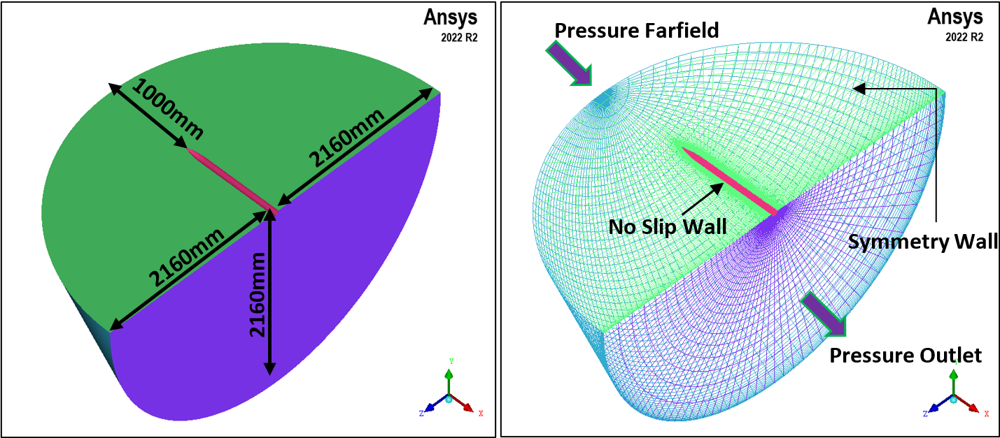
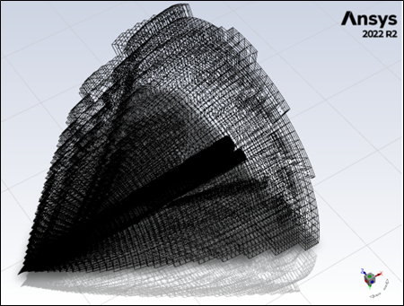

# Computational Fluid Dynamics for Missile Aerodynamics

**Project:** CFD for Aerospace - Assignment project 

**Supervisors:** Dr. Zeeshan Rana and Dr Davide Di Pasquale 

---

## 📖 Project Overview

This project focused on the **CFD analysis of missile aerodynamics**, studying a tangent ogive / cylinder body missile geometry to compute aerodynamic coefficients (normal, axial, and moment) under high-speed conditions. The primary objective was to assess how different turbulence models in a RANS framework capture high-speed flow behavior, offering insights into their effectiveness in modeling such conditions.

---

## 🏆 Key Objectives

1. **Create** a suitable mesh, choosing between structured or hybrid meshing approaches.
2. **Define** solution algorithms, select appropriate turbulence models.
4. **Analyze** simulation results, comparing findings with the provided experimental data.
5. **Compile** findings to identify the suitability of turbulence models for supersonic flow scenario.
---
## 🧪 Test Case 

Two test cases were computed, for zero degrees and 10 degree angles of attack. The flow was assumed to be axsymmetric about the windward axis requiring only a quarter model. 

  
| Variable | Description                   | Value         | SI Unit       |
|----------|-------------------------------|---------------|---------------|
| M∞       | Mach number                   | 2.0           | -             |
| D        | Diameter                      | 80            | mm            |
| ReD      | Reynolds number based on D    | 1.2 × 10⁶     | -             |
| p∞       | Freestream pressure           | 15337         | Pa            |
| T∞       | Freestream temperature        | 166.666       | K             |
| Aref     | Reference area                | 0.00251327    | m²            |

Each variable corresponds to initial flow conditions or geometry, providing the basis for subsequent analyses in computational simulations.

---

## ✈️ Background

The study of missile aerodynamics is essential for defense and aerospace industries, particularly for stability and control in supersonic and transonic flight. This project used computational fluid dynamics (CFD) to simulate complex flow phenomena around a missile body at high speed, focusing on shock waves, boundary layer behavior and separation.

---

## 🔍 Methodology

1. **Geometry and Meshing**  
   - The missile forebody configuration of interest is a 3 calibre tangent ogive / cylinder body of 15 calibre total length. 
   - Meshing was conducted using **ICEM CFD**, with a refined mesh in boundary layer and adaptive mesh setting to capture shock wave flow characteristics.

|Location | Boundary Condition                   | Value         |
|----------|-------------------------------|---------------|
| Body      | No Slip Wall                   |-          |
| Farfield | Pressure Farfield                     | 15337 Pa          |
| Outflow  | Pressure Outlet    | 15337 Pa    | 
| Symmetry     | Symmetry           | -         |

 

 

2. **CFD Simulation Setup**  
   - **Software:** ANSYS Fluent
   - **Turbulence Models:** Primarily Spalart-Allmaras (SA) and k-omega SST, compared with k-epsilon Realizable and Reynolds Stress models.
   - **Boundary Conditions:** Applied based on the flow Mach number and angle of attack.
   - **Solver Settings:** Steady-state RANS simulations were used, ensuring convergence in aerodynamic forces and moments.

3. **Validation Metrics**  
   - **Coefficient Comparison:** Normal, axial, and moment coefficients were computed and validated against experimental data.
   - **Flow Analysis:** Mach contours, pressure distributions and boundary layer profiles were analysed to observe flow behaviour.

---
## 📈 Data and Results

### Coefficient Data and Mach Contours

- **Normal Coefficient (Cn), Axial Coefficient (Ca), and Moment Coefficient (Cm)**: Calculated for each turbulence model and summarised in the [results folder](./results).
- **Mach Contours and Pressure Distributions:** Visualized the impact of shock wave interaction and boundary layer separation.

### Visualizations

Simulation visualizations are available in the [results folder](./results).

---

## 📊 Findings and Analysis

- **Aerodynamic Coefficients:** Computed axial, normal and moment coefficients of the missile body.
- **Turbulence Models:**  
   - **Spalart-Allmaras (SA):** Suitable for lower angles of attack, providing accurate force predictions.
   - **k-omega SST:** Performed well in capturing shock-boundary layer interactions at higher angles and Mach conditions.
- **Shock Wave Behavior:** Observed shock locations, Leeside Vortex and flow separations as a function of angle of attack at Mach 2.

 

---

## 🛠️ Tools and Technologies

- **CAD and Meshing:** CATIA V5, ICEM CFD
- **CFD Software:** ANSYS Fluent
- **Turbulence Models:** Spalart-Allmaras, k-omega SST, k-epsilon Realizable, Reynolds Stress model
- **Solution Techniques:** Steady-state RANS for high-speed flow predictions

---

## 📌 Key Contributions

1. **BlockMesh Generation**: Successfully generated the BlockMesh with careful adherence to mesh orthogonality and other quality criteria. Applied mesh adaptation techniques to optimize mesh quality, enabling efficient and stable solutions in ANSYS Fluent. This improvement significantly reduced computational time, allowing for a more comprehensive comparison of turbulence models in the final report.
2. **Turbulence Model Evaluation**: Conducted an in-depth study of various turbulence models by analyzing their transport equation performance across different flow fields. Based on this understanding, selected a targeted range of models to solve the Navier-Stokes equations effectively. The shortlisted models—Realizable k-epsilon, k-omega SST, Spalart-Allmaras (SA), and Reynolds Stress Model—were chosen for their suitability in capturing key flow characteristics, ensuring a comprehensive and informed comparison in the final report.
3. **Validation and Accuracy:** Demonstrated accuracy in capturing critical flow phenomena, achieving validation within reasonable error margins.

---

## 📝 Future Scope

- **Enhanced Meshing** for regions with high shock interaction and boundary layer complexities.
- **Transient Simulations** using DDES for a more detailed study of flow unsteadiness at higher angles.

---

## 📫 Contact

For further information or questions, please feel free to reach out:

 

---

*This project was submitted as part of the MSc in Aerospace Dynamics at Cranfield University in a group setting.*

---
